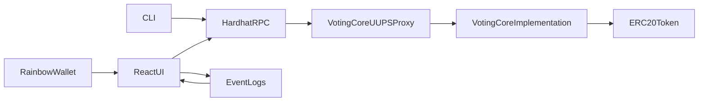

# Architecture (v1)

## 1. Monorepo Layout

Target structure to adapt this repository:

```text
packages/
  contracts/   # Hardhat project, Solidity, deploy scripts, contract tests
  web/         # React app (Rainbow wallet integration)
  cli/         # Node-based CLI for proposal/vote/results
  shared/      # Optional shared types/ABIs/helpers
```

## 2. Component Responsibilities

- `contracts`:
  - canonical business state and access control,
  - upgradeable deployment artifacts (UUPS).
- `web`:
  - wallet-driven UX for space/proposal/voting,
  - rendering on-chain state from RPC.
- `cli`:
  - scriptable access to create proposal, cast vote, read results.
- `shared` (optional):
  - ABI exports, ids and serializer utilities.

## 3. Runtime Data Flow



## 4. Voting Power Model (v1)

- Weight source: `token.balanceOf(voter)` at vote tx execution.
- No historical snapshot in v1.
- Consequence:
  - simple implementation and faster delivery,
  - dynamic power can change between votes and re-votes,
  - acceptable trade-off for local-first MVP.

## 5. Read Model

- Storage views:
  - canonical proposal metadata and current tallies.
- Event logs:
  - append-only timeline for activity/history in UI.
- UI reconciliation strategy:
  - render current state from views,
  - enrich with events (who voted when, recast history).

## 6. Upgrade Model

- UUPS proxy with single implementation pointer.
- Only authorized role can upgrade implementation.
- Upgrade-safe storage evolution is mandatory.

## 7. Boundaries and Future Extensions

Possible v2 extensions (not in v1):
- true block-time snapshots (`balanceOfAt` style token),
- gasless signatures for vote/proposal submission,
- off-chain metadata pointers (IPFS/Arweave),
- network expansion to Polygon testnet/mainnet.
